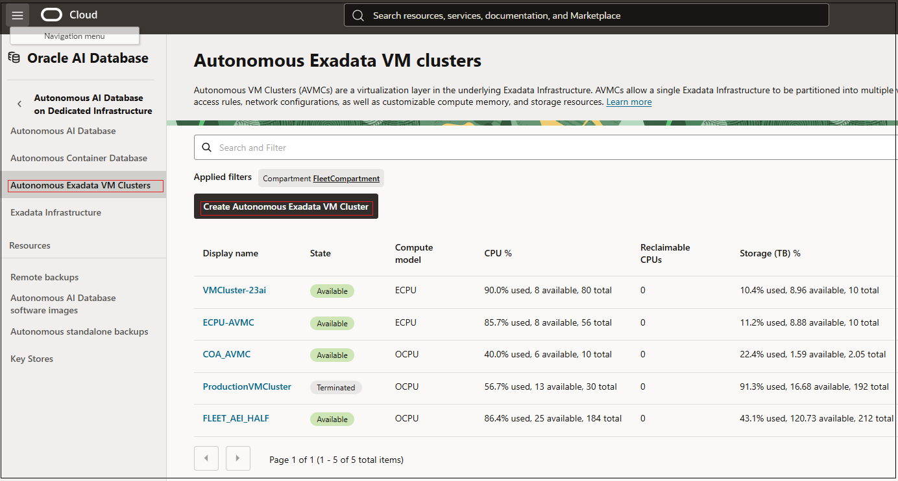
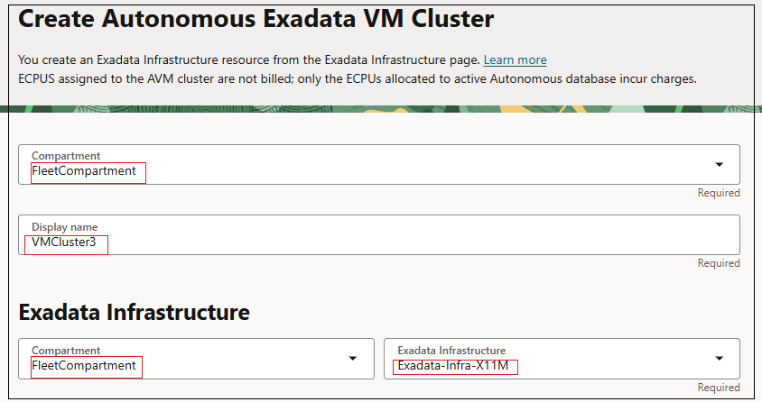
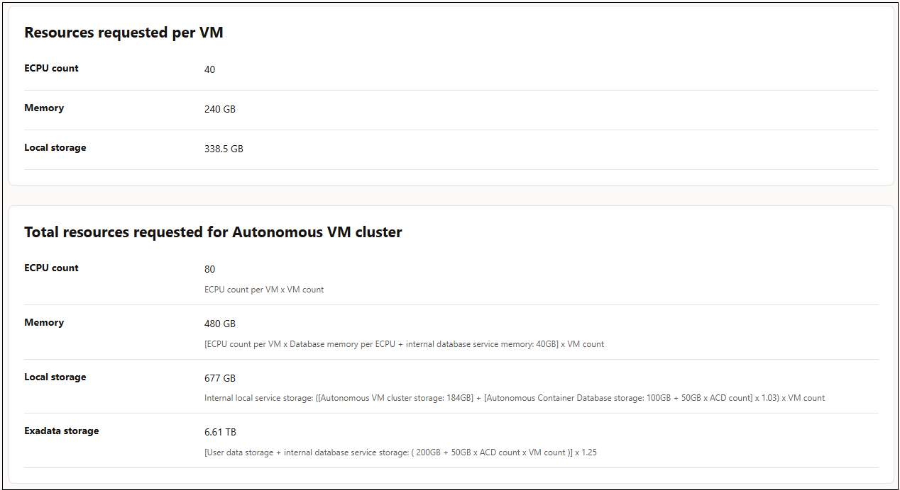
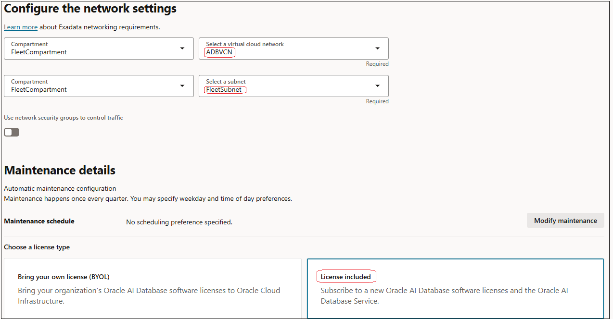
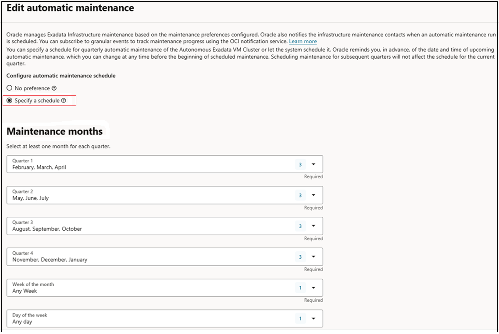
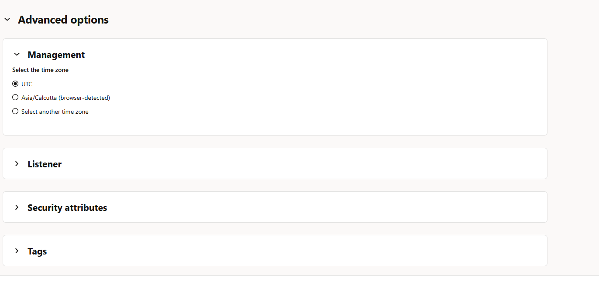

# Provisioning a Cloud Autonomous Exadata VM Cluster for Autonomous AI Database on Dedicated Infrastructure

## Introduction

An Autonomous Exadata VM Cluster is a set of symmetrical VMs across all Compute nodes. Autonomous Container Database and Autonomous AI Databases run all the VMs across all nodes enabling high availability. It consumes all the resources of the underlying Exadata Infrastructure.

**This lab provides steps to set up an Autonomous VM Cluster on your Exadata Infrastructure.**

Estimated Time: 20 minutes

### Objectives

- Create an Autonomous VM Cluster on a pre-provisioned Exadata Infrastructure.

### Required Artifacts
- An Oracle Cloud Infrastructure account with a pre-provisioned instance of Exadata Infrastructure.

Watch the video below for step by step directions on creating an Autonomous VM Cluster on your Exadata Infrastructure.

## Create an Autonomous VM Cluster on your Exadata Infrastructure

*Log in to your OCI account as a fleet administrator.*
- Navigate to the **Oracle AI Database** option in the top left hamburger menu from your OCI home screen. Click **Autonomous AI Database on Dedicated Infrastructure**.
- Select **Autonomous Exadata VM Cluster** from the menu on the left. Click **Create Autonomous Exadata VM Cluster**.
         
  

- Perform the following tasks on the **Create Autonomous Exadata VM Cluster** page.

    1. **Choose a compartment** to deploy the Autonomous VM Cluster. Enter a user-friendly description or other information that helps you easily identify the infrastructure resource. 

    2. **Select the Exadata Infrastructure to host the new Autonomous Exadata VM Cluster.** Change the compartment if your Exadata Infrastructure was created in a different compartment than the one shown.
          
          

    3. **Configure the Autonomous VM Cluster Resources:**

          - Compute Model: Denotes the compute model for your Autonomous Exadata VM Cluster resource. Default model is ECPU. This is based on the number of cores elastically allocated from a pool of compute and storage servers.

              

          - DB Server Selection: Lists the DB Servers (VMs) used to deploy the new Autonomous Exadata VM Cluster (AVMC) resource. The maximum resources (CPUs, Memory, and Local Storage) available per VM is also displayed. Optionally, you can add or remove the VMs by clicking Edit DB Server Selection. Clicking this button launches the Change DB Servers dialog listing all the available DB Servers 

            

          - VM count or Node Count: Denotes the number of database servers in the Exadata infrastructure. This is a read-only value. 

          - Maximum number of Autonomous Container Databases: The number of ACDs specified represents the upper limit on ACDs. These ACDs must be created separately as needed.

          - CPU count per VM or node: Specify the CPU count for each individual VM. The minimum value is 40 ECPUs per VM.

          - Database memory per CPU (GB): The memory per CPU allocated for the Autonomous AI Databases in the Autonomous VM Cluster.

          - Database storage (TB): Data storage allocated for Autonomous AI Database creation in the Autonomous VM Cluster. The minimum value is 5TB.

            

    4. **Configure network settings.** Select the VCN and subnet in which your VM Cluster will be deployed.
          - Virtual cloud network: The virtual cloud network (VCN) in which you want to create the new Autonomous Exadata VM Cluster.

          - Subnet: A subnet within the above selected VCN for the new Autonomous Exadata VM Cluster.
          
          Optionally, you can use network security groups to control traffic. To do so, Turn on the option to use network security groups and choose a Network Security Group from the select list.

            
    
    5. **Configure Automatic Maintenance:** Optionally, configure the automatic maintenance schedule by clicking Modify Schedule. You can then change the maintenance schedule by specifying quarter, week, day and time you would like to schedule automatic maintenance for your Autonomous Exadata VM Cluster.

          

    6. **Choose the license type** you wish to use.
            - Bring your own license: If you choose this option, make sure you have proper entitlements to use for new service instances that you create.
            - License included: With this choice, the cost of the cloud service includes a license for the Database service
    
    7. In the advanced options, you may pick a different timezone than the default UTC. You can optionally add a security attribute to control access for your AVMC resource using Zero Trust Packet Routing (ZPR) policies. If you want to use tags, add tags by selecting a Tag Namespace, Tag Key, and Tag Value.

          

- Click **Create Autonomous Exadata VM Cluster**.

Once created, your Autonomous Exadata VM Cluster is ready to deploy Autonomous Container Databases.

*All Done! You have successfully setup your Autonomous VM Cluster for Autonomous AI Database on Dedicated Infrastructure. It is now ready to deploy Autonomous Container Databases*

You may now **proceed to the next lab**.

## Acknowledgements

- **Author** - Ranganath, S R, Simon Law & Kris Bhanushali
- **Updated By/Date** - Vandana Rajamani, December 2025
- **Last Updated By/Date** - Vandana Rajamani, November 2025

## See an issue or have feedback?
Please submit feedback [here](https://apexapps.oracle.com/pls/apex/f?p=133:1:::::P1_FEEDBACK:1).   Select 'Autonomous DB on Dedicated Exadata' as workshop name, include Lab name and issue / feedback details. Thank you!
