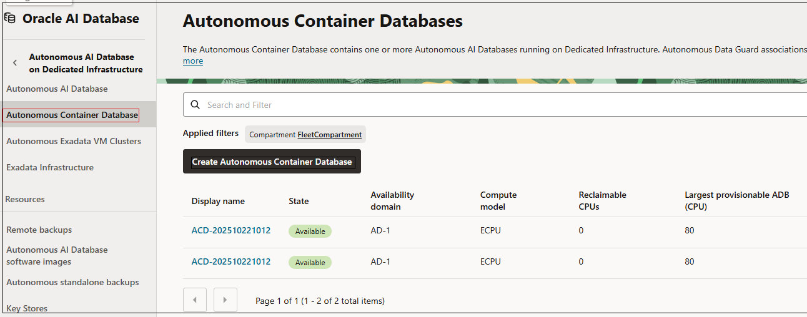
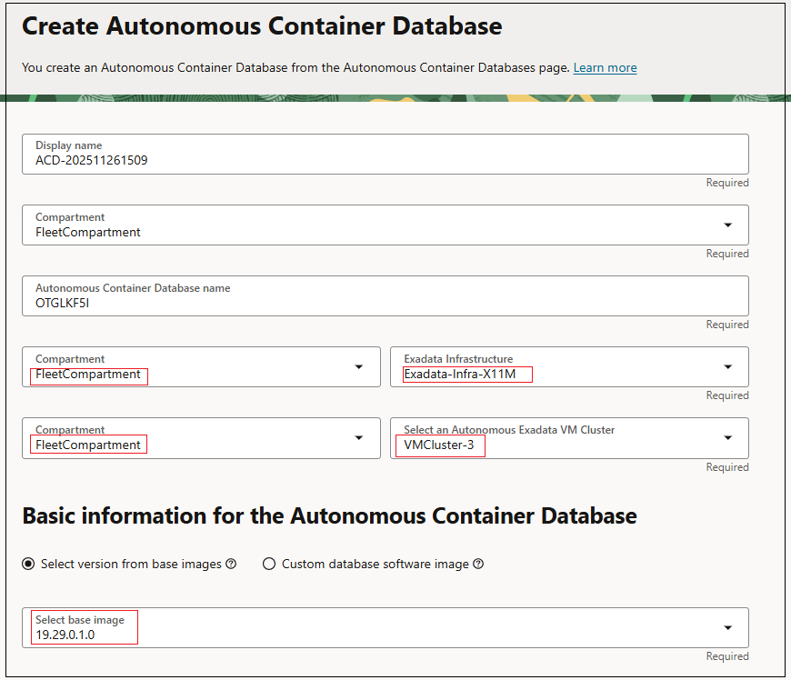
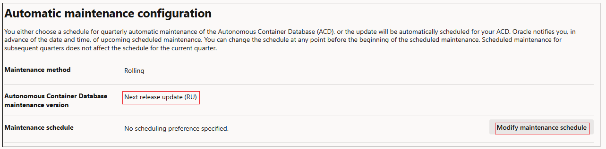
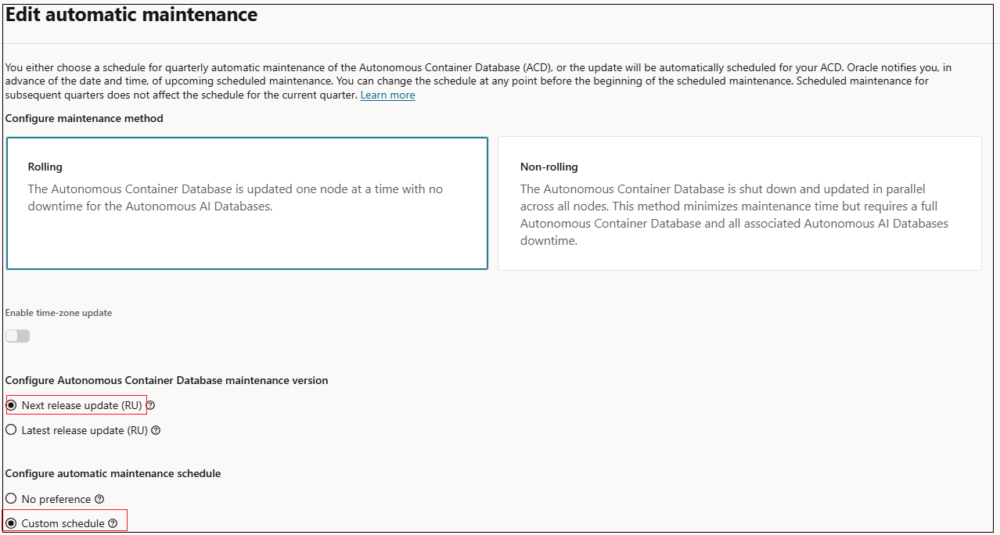
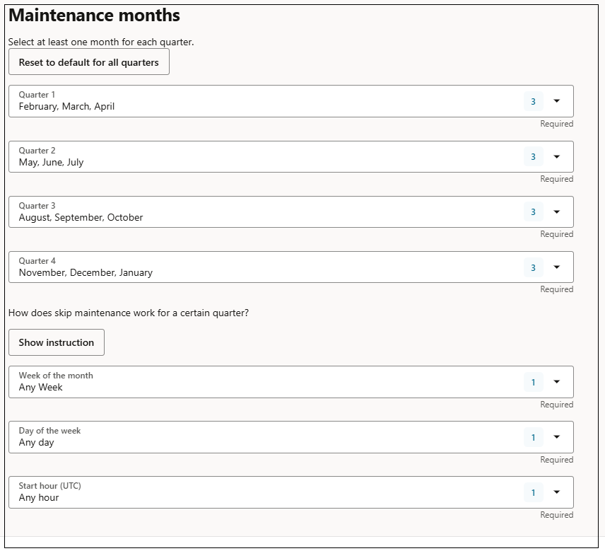
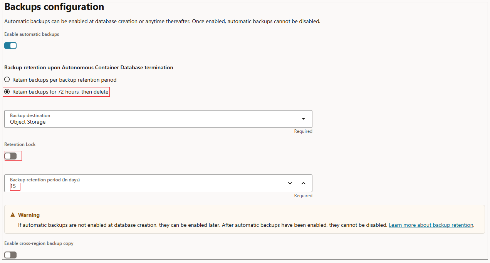
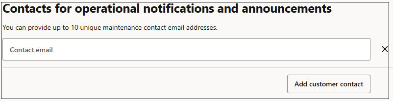
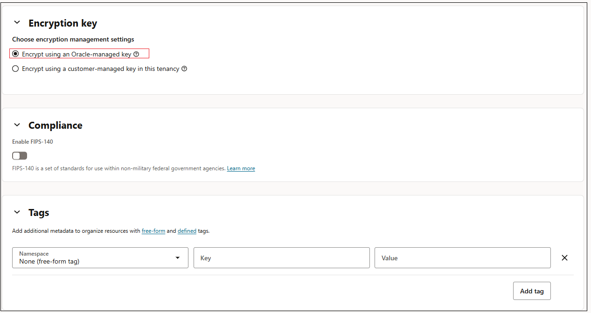

# Provisioning an Autonomous Container Database

## Introduction
An Autonomous Container Database resource provides a container for your Autonomous AI Databases. You can create multiple Autonomous Container Database resources in an Autonomous Exadata VM Cluster resource, but you must create at least one ACD before you can create any Autonomous AI Databases.

Estimated Time: 20 mins

### Objectives

As a fleet administrator:
- Deploy an Autonomous Container Database (ACD) onto an Autonomous Exadata VM Cluster (Applicable to both ADB on Exadata Cloud@Customer and ADB on public cloud).

**Note: When using Exadata Cloud@Customer, ACDs are deployed on Autonomous VM Clusters**

### Required Artifacts

- An Oracle Cloud Infrastructure account with fleet administrator privileges. For a detailed description of required IAM policies, please refer to the [documentation on IAM policies](https://docs.oracle.com/en/cloud/paas/autonomous-database/adbdf/) in the Autonomous AI Database Dedicated documentation set.

## Task 1: Create an Autonomous Container Database (ACD)

*Log in to your OCI account as a fleet administrator*

- Navigate to the **Oracle AI Database** option in the top left hamburger menu from your OCI home screen. Click **Autonomous AI Database on Dedicated Infrastructure**.

- Select **Autonomous Container Database** from the menu on the left. Click **Create Autonomous Container Database**.

    

- On the **Create Autonomous Container Database** dialog box you can choose / modify the compartment to create your ACD. Select the compartment hosting your Exadata Infrastructure and Autonomous Exadata VM Cluster.

- Enter a user-friendly description or other information that helps you easily identify the resource. Enter a name for the container database. It can contain only letters and numbers. 

- Choose the Exadata Infrastructure and an Autonomous Exadata VM Cluster to host the new Autonomous Container Database.

- Choose the Oracle Database software version for the Autonomous Container Database.

    

- You will see an option to modify your ACD's maintenance schedule and the type of update you wish to apply to the container. Optionally, you can configure a maintenance preference or schedule by clicking Modify maintenance schedule that launches the Edit automatic maintenance dialog.

    

- You can choose between Rolling or Non-rolling maintenance methods. Optionally, you can also select Enable time-zone update. You can change the maintenance schedule from the default to a custom schedule.

    

- You can specify your ACD's maintenance schedule, picking a month, week, day and time in each quarter when a maintenance operation can be carried out on that container.
    
    

- By default, automatic backups are enabled for an ACD. Optionally, you can choose to disable them by deselecting the Enable automatic backups check box. When you enable automatic backups, choose from the following options to determine how long backups are retained after terminating the ACD: 
   - Retain backups as per the backup retention period
   - Retain backups for 72hours, then delete

- You can associate a backup destination for the backups of Autonomous AI Databases created in an ACD. You can choose Object Storage or Autonomous Recovery Service (recommended option) as the backup destination for Autonomous AI Databases deployed On Oracle Public Cloud.  If creating the Autonomous Container Database on Exadata Cloud@Customer, configure the backup destination to be used for backups of Autonomous AI Databases created in the Autonomous Container Database. Select a Backup Destination Type and then specify options based on the selected type.

- If you choose to retain backups for the duration of the backup retention period, you can also enable retention lock.

- After enabling automatic backups, specify a Backup retention period value to meet your needs. You can choose any value between 7 to 95 days.

- Optionally, select Enable cross-region backup copy and specify a region for the backup copies.

    

- Optionally, you can add contact emails to receive operational notifications, announcements, and unplanned maintenance notifications regarding your Autonomous Container Database.

   

- Optionally, you can define a suitable value for the following resource management attributes to suit your needs. Optionally, select Enable shared server connections to support the Net services architecture.

   

- Optionally, you can configure the Autonomous Container Database to use customer-managed encryption keys instead of Oracle-managed encryption keys. Select **Encrypt using customer-managed keys** and then select either the **Vault and Master** encryption key or the **Key Store** to use for the Autonomous Container Database, depending on whether you are creating the container database on Oracle Cloud or on Exadata Cloud@Customer.

- Optionally, you may also enable FIPS-140 security standards.

- If you want to use tags, add tags by selecting a Tag Namespace, Tag Key, and Tag Value.

   

That's it. Simply scroll down to the bottom and click the blue **Create Autonomous Container Database** button to deploy your ACD.

You may now **proceed to the next lab**.

## Acknowledgements

*All Done! You have successfully deployed your Autonomous Container Database and it should be available shortly.*

- **Author** - Ranganath S R, Tejus S. & Kris Bhanushali
- **Updated By/Date** - Vandana Rajamani, December 2025
- **Last Updated By/Date** - Vandana Rajamani, December 2025

## See an issue or have feedback?
Please submit feedback [here](https://apexapps.oracle.com/pls/apex/f?p=133:1:::::P1_FEEDBACK:1).   Select 'Autonomous DB on Dedicated Exadata' as workshop name, include Lab name and issue / feedback details. Thank you!
