# Provisioning a Cloud Exadata Infrastructure for Autonomous AI Database in OCI

## Introduction
A Cloud Exadata Infrastructure resource is the top-level (parent) resource for Autonomous AI Database on Dedicated Infrastructure. At the infrastructure level, you control the number of database and storage servers. You also control Exadata system maintenance scheduling at the Exadata infrastructure level. You must create at least one Exadata Infrastructure resource before you can create any of the other kinds of dedicated infrastructure resources such as Autonomous Container Databases or simply an Autonomous AI Database instance.

Estimated Time: 20 minutes

### Objectives

As a fleet administrator:
1. Deploy Cloud Exadata Infrastructure in your OCI account.
2. Understand Cloud Exadata Infrastructure maintenance scheduling.

### Required Artifacts
- An Oracle Cloud Infrastructure account with service limits to deploy at least one 1/4 rack of Exadata Infrastructure (or 2 database servers and 3 storage servers limits) in any region's Availability Domain.
- You also need privileges to create Exadata Infrastructure and Autonomous Container database in a pre-provisioned compartment and network.

## Task 1: Check / Add Service Limits in your tenancy to create Cloud Exadata Infrastructure.

Your tenancy has limits on the maximum number of resources you're allowed to use. You can use quotas to allocate resources to compartments. If you're an administrator in an eligible account, you can request a service limit increase.

*Log in to your OCI account as an Administrator.* 

- Navigate to **Governance & Administration** . Under **Tenancy Management**, click **Limits, quotas and Usage**.

    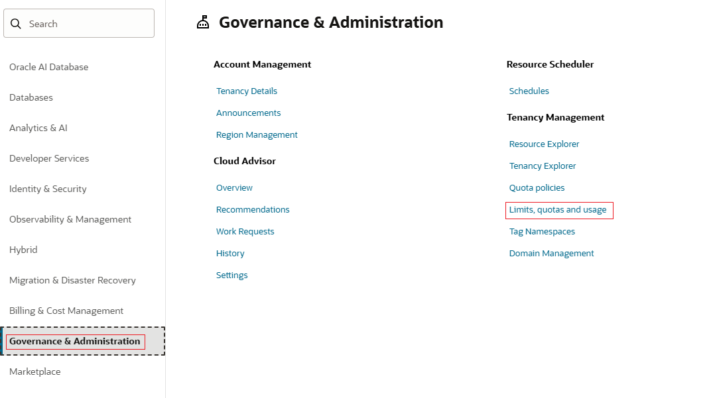    
- Click **Edit Filters** and enter Service as **Database**. In Scope choose the desired Availability Domain where you want to deploy your Cloud Exadata infrastructure. In Compartment, choose the compartment where you want to deploy your Cloud Exadata infrastructure. Click **Update**. In the search box, enter **Exadata X11M**.
- The list should show all the available resources, Exadata X11M Database Server Count and Exadata X11M Storage Server Count available or used in selected Availability Domain. 

    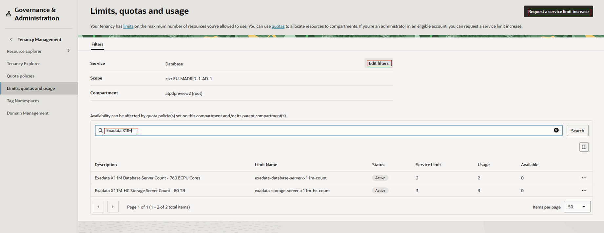
- To increase the Service in your tenancy, click on **Request a service limit increase** . Provide the request name and reason for the request.

    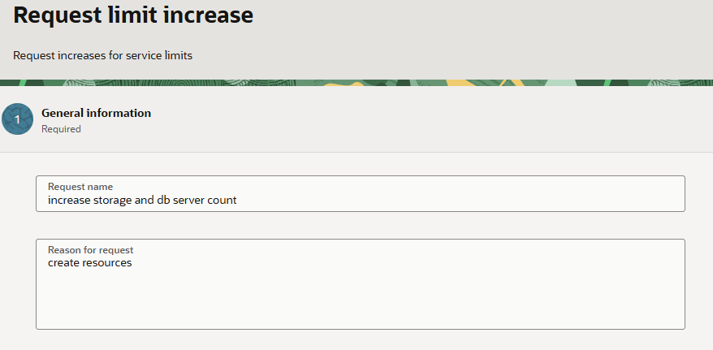
- Search for the name of the limit and update the values for each availibility domain.
 
    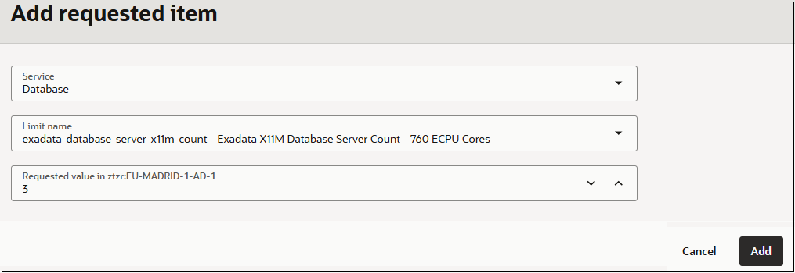
- Verify if the values indicated are correct and submit the request.

    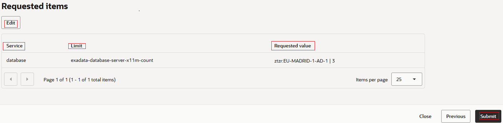

    

## Task 2: Deploy your Cloud Exadata Infrastructure

*Log in to your OCI account as a fleet administrator.*

- Navigate to the **Oracle AI Database** option in the top left hamburger menu from your OCI home screen. Click **Autonomous AI Database on Dedicated Infrastructure**.
- Select **Exadata Infrastructure** and ensure you pick the desired fleet compartment as shown above. Click **Create Exadata Infrastructure**.

  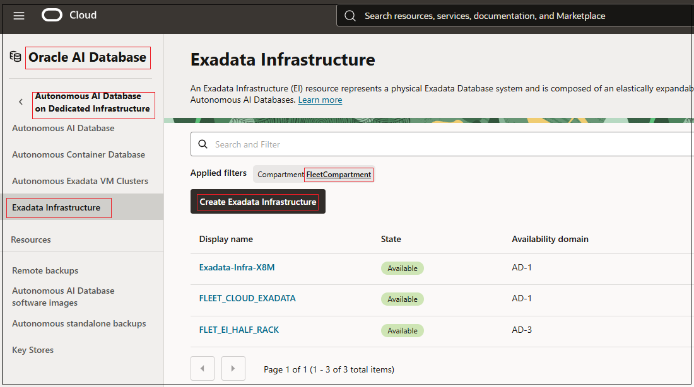
- Enter a user-friendly description or other information that helps you easily identify the resource as the name for the Exadata Infrastructure and select the Availability Domain in which you want the CEI to be created. Choose the type of Oracle Exadata Database Machine you want to allocate to this resource.

 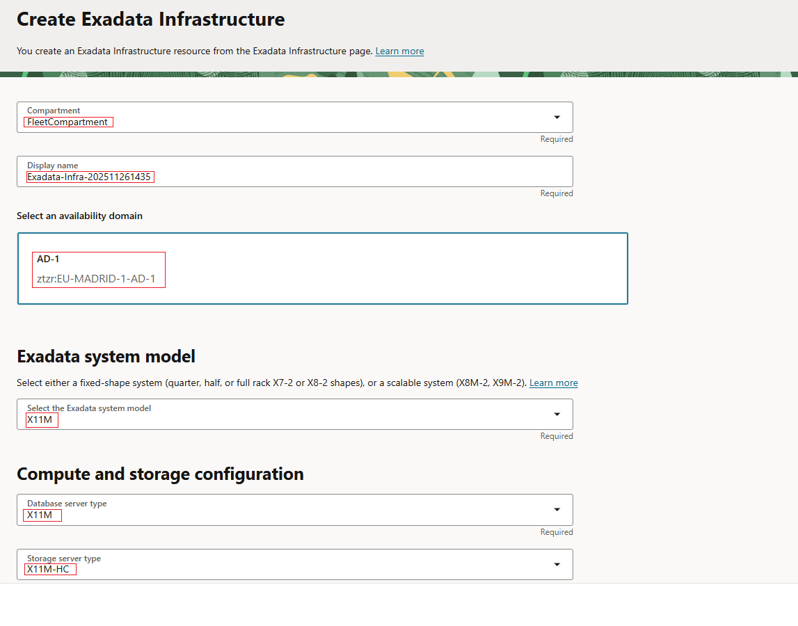
- Specify the number of database and storage servers for configuring your Exadata Infrastructure resource. The default configuration is 2 database servers and 3 storage servers. However, you have the flexibility to choose a different value for database servers and storage servers within a valid range. The acceptable range of values is 2 to 32 for database servers and 3 to 64 for storage servers. 

 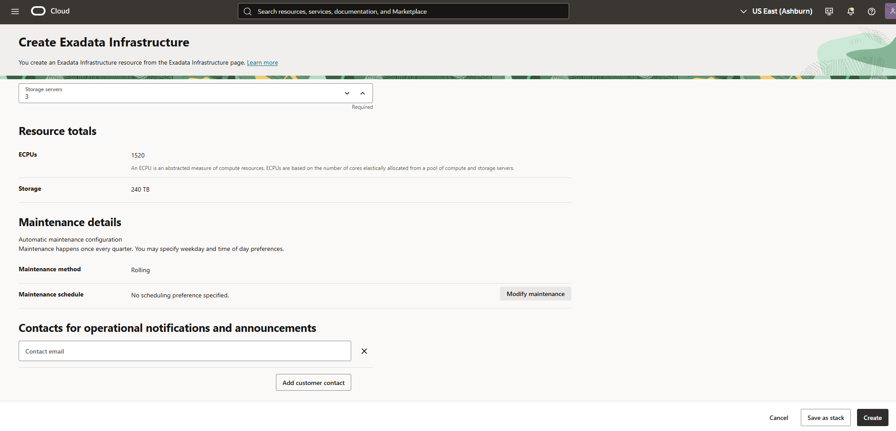
- Optionally, you can configure the automatic maintenance schedule by clicking **Modify maintenance**.

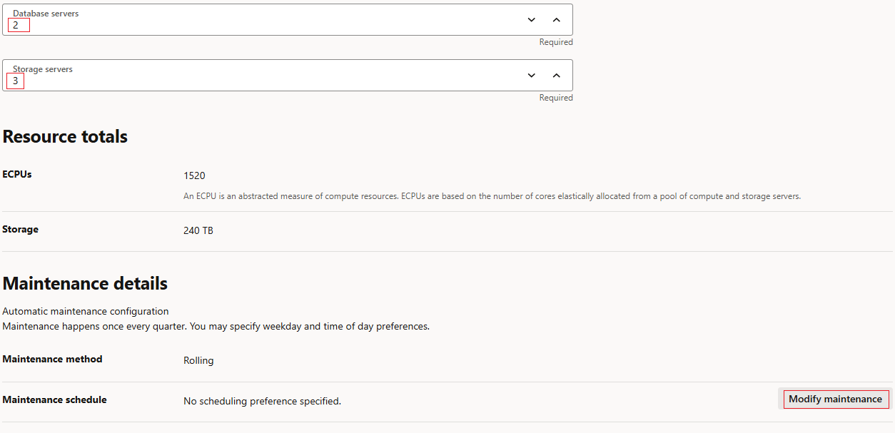
- You can then change the maintenance schedule by specifying quarter, week, day and time you would like to schedule automatic maintenance for your exadata hardware.

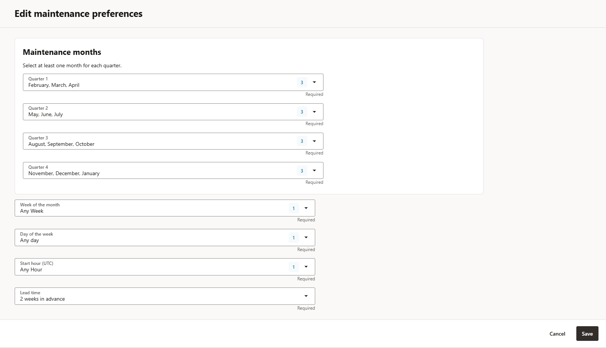    

- After you add the contact emails for operational notifications and announcements, click **Create Exadata Infrastructure**. Your CEI will soon be ready to deploy autonomous container databases.

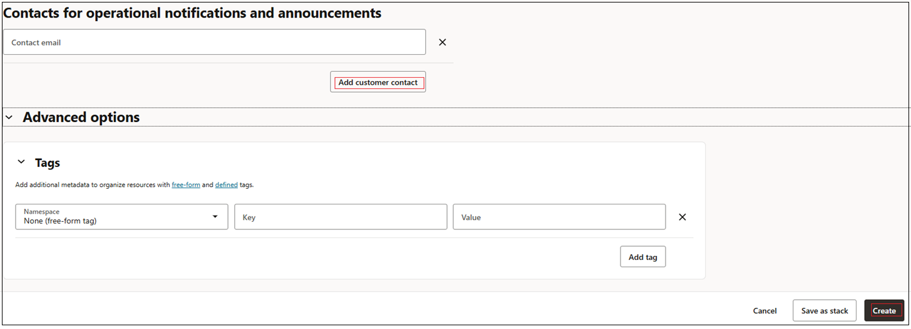 

*All Done! You have successfully deployed your Autonomous Exadata Infrastructure and it should be available shortly.*

You may now **proceed to the next lab**.

## Acknowledgements

- **Author** - Ranganath S R & Kris Bhanushali
- **Adapted by** -  Yaisah Granillo, Cloud Solution Engineer
- **Updated By/Date** - Vandana Rajamani, November 2025
- **Last Updated By/Date** - Vandana Rajamani, February 2026

## See an issue or have feedback?  
Please submit feedback [here](https://apexapps.oracle.com/pls/apex/f?p=133:1:::::P1_FEEDBACK:1).   Select 'Autonomous DB on Dedicated Exadata' as workshop name, include Lab name and issue / feedback details. Thank you!
